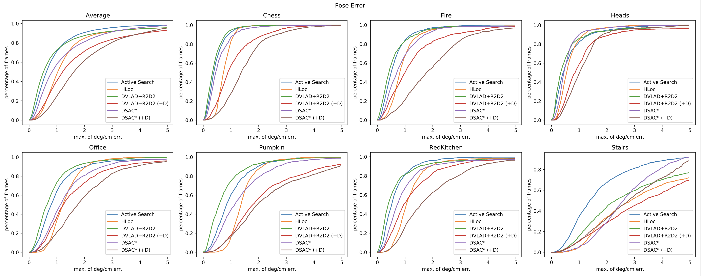

# On the Limits of Pseudo Ground Truth in Visual Camera Re-Localization

This repository contains the evaluation code and alternative pseudo ground truth poses as used in our [ICCV 2021 paper](https://openaccess.thecvf.com/content/ICCV2021/html/Brachmann_On_the_Limits_of_Pseudo_Ground_Truth_in_Visual_Camera_ICCV_2021_paper.html).

<p align="center">
  <a href="https://storage.googleapis.com/niantic-lon-static/research/limits-of-pgt/iccv21_pgt_high.mp4">
  
  </a>
</p>


## Pseudo Ground Truth for 7Scenes and 12Scenes

We generated alternative SfM-based pseudo ground truth (pGT) using [Colmap](https://colmap.github.io/index.html) to supplement the original D-SLAM-based pseudo ground truth of [7Scenes](https://www.microsoft.com/en-us/research/project/rgb-d-dataset-7-scenes/) and [12Scenes](http://graphics.stanford.edu/projects/reloc/).


### Pose Files

Please find our SfM pose files in the folder `pgt`.
We separated pGT files wrt datasets, individual scenes and the test/training split. 
Each file contains one line per image that follows the format:

```
rgb_file qw qx qy qz tx ty tz f
```
Entries `q` and `t` represent the pose as quaternion and translation vector. 
The pose maps world coordinates to camera coordinates, i.e. `p_cam = R(q) p_world + t`. 
This is the [same convention used by Colmap](https://colmap.github.io/format.html#images-txt).
Entry `f` represents the focal length of the RGB sensor. 
`f` was re-estimated by COLMAP and can differ slightly per scene.

We also provide the original D-SLAM pseudo ground truth in this format to be used with our evaluation code below.

### Full Reconstructions
The [Colmap](https://colmap.github.io/index.html) 3D models are available here:
* [7Scenes](https://drive.google.com/file/d/1ATijcGCgK84NKB4Mho4_T-P7x8LSL80m/view?usp=sharing)
* [12Scenes](https://drive.google.com/file/d/1u5du-cYp3J3-BfybZVkhvgv0PPua8tud/view?usp=sharing)

Note that the Google Drive folder that currently hosts the reconstructions has a daily download limit. We are currently looking into alternative hosting options.

### License Information

Since the 3D models and pose files are derived from the original datasets, they are released under the same licences as the 7Scenes and 12Scenes datasets. 
Before using the datasets, please check the licenses (see the websites of the datasets or the README.md files that come with the 3D models). 

## Evaluation Code

The main results of our paper can be reproduced using ```evaluate_estimates.py```.
The script calculates either the pose error (max of rotation and translation error) or the DCRE error (dense reprojection error).
The script prints the recall at a custom threshold to the console, and produces a cumulative error plot as a PDF file.

As input, the script expects a configuration file that points to estimated poses of potentially multiple algorithms and to the pseudo ground truth that these estimates should be compared to.
We provide estimated poses of all methods shown in our paper (ActiveSearch, HLoc, R2D2 and DSAC*) in the folder ```estimates```.  
These pose files follow the same format as our pGT files described previously, but omit the final ```f``` entry.

Furthermore, we provide example config files corresponding to the main experiments in our paper.

Calling:
```
python evaluate_estimates.py config_7scenes_sfm_pgt.json
```
Produces a new file ```config_7scenes_sfm_pgt_pose_err.pdf```:



Call ```python evaluate_estimates.py --help``` for all available options.

### DCRE Computation

DCRE computation is triggered with the option ```--error_type dcre_max``` or ```--error_type dcre_mean``` (see our paper for details). 
DCRE needs access to the original [7Scenes](https://www.microsoft.com/en-us/research/project/rgb-d-dataset-7-scenes/) or [12Scenes](http://graphics.stanford.edu/projects/reloc/) data as it requires depth maps. 
We provide two utility scripts, ```setup_7scenes.py``` and ```setup_12scenes.py```, that will download and unpack the associated datasets. 
Make sure to check each datasets license, via the links above, before downloading and using them.

**Note I:** The original depth files of 7Scenes are not calibrated, but the DCRE requires calibrated files. 
The setup script will apply the Kinect calibration parameters found [here](https://projet.liris.cnrs.fr/voir/activities-dataset/kinect-calibration.html) to register depth to RGB. 
This essentially involves re-rendering the depth maps which is implemented in native Python and takes a long time due to the large frame count in 7Scenes (several hours). However, this step has to be done only once.

**Note II:** The DCRE computation by ```evaluate_estimates.py``` is implemented on the GPU and reasonably fast. 
However, due to the large frame count in 7Scenes it can still take considerable time. 
The parameter ```--error_max_images``` limits the max. number of frames used to calculate recall and cumulative errors. 
The default value of 1000 provides a good tradeoff between accuracy and speed. 
Use ```--error_max_images -1``` to use all images which is most accurate but slow for 7Scenes.

### Dependencies

This code requires the following python packages, and we tested it with the package versions in brackets

```
pytorch (1.6.0)
opencv (3.4.2)
scikit-image (0.16.2)
```

The repository contains an `environment.yml` for the use with Conda:
```bash
conda env create -f environment.yml
conda activate pgt
```

### License Information

Our evaluation code and data utility scripts are based on parts of [DSAC*](https://github.com/vislearn/dsacstar), and we provide our code under the same BSD-3 license.

## Citation
If you are using either the evaluation code or the Structure-from-Motion pseudo GT for the 7Scenes or 12Scenes datasets, please cite the following work:
```
@InProceedings{Brachmann2021ICCV,
    author = {Brachmann, Eric and Humenberger, Martin and Rother, Carsten and Sattler, Torsten},
    title = {{On the Limits of Pseudo Ground Truth in Visual Camera Re-Localization}},
    booktitle = {International Conference on Computer Vision (ICCV)},
    year = {2021},
}
```
